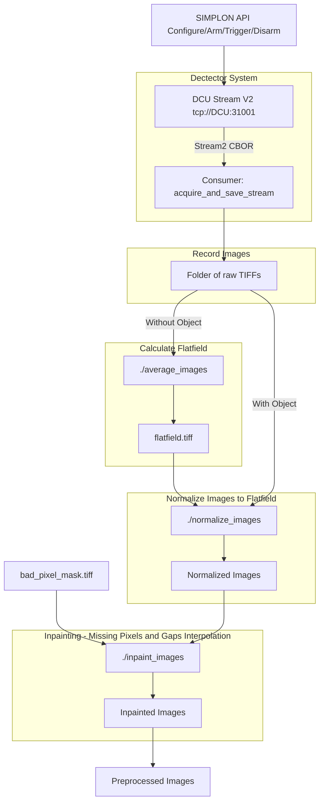

# Birmenstorf — DECTRIS Stream V2 acquisition and offline processing

This repository is a **workstation-side** toolkit for **DECTRIS EIGER** setups: you drive the **DCU** over **REST (Simplon)** and **consume Stream V2** (CBOR over ZeroMQ) to save TIFF stacks. The **main story** below is an end-to-end **measurement and correction** flow:

1. **Acquire a flat-field series** from the stream (or average saved frames).
2. **Produce one flat-field reference** (mean image).
3. **Normalize** object frames with that flat field.
4. **Inpaint** bad pixels or gaps using a **mask** TIFF.

The DCU is the **producer** of stream data; programs here are **consumers** (stream + disk) and **control clients** (HTTP only—they never parse the stream themselves).

---

## End-to-end pipeline (flat field → normalize → inpaint)
A block diagram of a simple image pipeline using the tools given in this repository is described below:

## Example 1 - A Simple Acquisition and Analysis Pipeline

We start the stream consumer before** the detector emits frames you care about, i.e. before the **trigger** signal is sent. Whe the trigger is sent, the detector starts acquiring and streaming immediately. If the consumer starts late, the first frames of a burst can be lost.

The trigger is send via software (```"ints"```), but the detector also be triggered via a hardware signal on the **Lemo** connector in the back of the detector (more information in the manual).

We firts first acquire the **Flatfield**, process the data, and apply the flatfield for the normalization of the data acquires in the following steps.

The datasets are processed ```average_images```, ```normalize_images```and ```inpaint_images``` ** on raw (or exported) object frames. 

The bad pixel mask uses **0** = good pixel, **any positive value** = inpaint.

### A - Prepare the Data Acquisition and Configure the Detector
Configure the acquisition. The script will configure the image interface, threshold energy, count_time, number_of_trigger, number_of_images. 
``` ./bin/connect_and_configure_and_arm_detector <dcu_ip_address>```

The default setting in the programm are the following:
- Energy Threshold: 15000 eV
- Exposure Time: 0.001 s
- Number of Thresholds: 1
- Number of Triggers: 100000
- Number of Images (per trigger): 10000
- Trigger Mode: ```ints```
Change the code and recompile for different values. 

### B - Acquire Flatfield
Remove the object under test, and acquire 200-1000 images with an exposure time such that each pixels has > 1000 counts/pixel. 
1. Start the stream receiver ```./bin/acquire_and_save_stream  <dcu_ip_address> --nimages 1000 --output ./my_ff_data```
1. Trigger the detector ```./bin/send_software_trigger <dcu_ip_address>```
1. Average the images to generate the flatfield.tiff ```./bin/average_images ./my_ff_data flatfield.tiff```

### C - Acquire and Preprocess
Acquire a dataset with images from your object, normalize them to the flatfield and pre-process them, interpolating the missing infomation from the gaps and the bad pixels map.
1. Start the stream receiver ```./bin/acquire_and_save_stream  <dcu_ip_address> --nimages 1000 --output ./my_obect_data```
1. Trigger the detector ```./bin/send_software_trigger <dcu_ip_address>``` 
1. Normalize the data to the flatfield ```./bin/normalize_images  --flat my_flatfield.tiff  --in ./my_obect_data/ --out ./my_obect_data_normalized/```
1. Perform the inpainting of the images ```./bin/inpaint_tiff  --mask bad_pixel_mask.tiff  --in ./my_obect_data_normalized/ --out ./pre_processed_images/```

You can repeat points 1 to 4 above multiple times without restarting the acquition, as we configure a very large number of trigger (100000 by default) For CdTe sensors, flatfield might change, so it might be worth to repeat the **Flatfield** acquisition process every 10-30 minutes depending on the incoming X-Ray flux.

### D - Disarming
After you are finished acquiring the data we suggest to terminate the data acquition by sending the ```disarm``` command. 
```./bin/disarm_detector <dcu_ip_address>```
If you need to restart the process, begin again from **Part A**

## Example 2 - A Continuous Pipeline


## Example 3 - Object / routine acquisition

Run your stream receiver (**`./bin/DectrisStream2Receiver_linux`**, **`./bin/acquire_and_save_stream`**, or **`./bin/stream2_generic_receiver`** in the appropriate mode) **before** triggers, and save object data to a folder of TIFFs. Use **`wait_idle_and_disarm_detector`** when you finish a clean run.


## Available Executables (summary)

| Target | Role |
|--------|------|
| **`stream2_generic_receiver`** | One binary, **mode** `buffer` \| `buffer-decode` \| `dump` \| `bifurcator` (first arg or `--mode`). |
| **`DectrisStream2Receiver_linux`** | Buffer stream, decode stack, write TIFFs; **`--threads`** for decode/TIFF flush. |
| **`acquire_and_save_stream`** | Fixed **`--nimages`**; optional **`--generate-flatfield`** / **`--generate-flatfield-only`** and **`--flatfield-file`**. |
| **`average_images`** | Mean of all single-channel **`*.tif`** / **`*.tiff`** in a folder → one float32 TIFF (LibTIFF). |
| **`normalize_images`** | Flat-field divide; batch **`--in`**, **`--flat`**, **`--out`** (OpenCV). |
| **`inpaint_tiff`** | Mask-driven inpainting on normalized float TIFFs (OpenCV **photo**). |
| **`data_analysis_pipeline_example`** | Small offline TIFF folder example (LibTIFF). |
| **Detector control quartet** | **`connect_and_configure_and_arm_detector`**, **`send_software_trigger`**, **`wait_idle_and_disarm_detector`**, **`disarm_detector`**. |

**Windows-only:** **`DectrisStream2Demo_windows`** when building on Windows.

---

## Build

```sh
git submodule update --init --recursive
cmake -B build -S .
cmake --build build
```

Executables appear under **`./bin/`**. On Linux you need **libzmq** (e.g. **`libzmq3-dev`**). Optional: **OpenCV** with **core**, **imgcodecs**, **imgproc**, **photo** for **`normalize_images`** / **`inpaint_tiff`**; **LibTIFF** (system or bundled submodule) for **`average_images`** and related tools. **`BUILD_LIBZMQ=ON`** can build ZeroMQ from source (see [`src/data_consumer/CMakeLists.txt`](src/data_consumer/CMakeLists.txt)).

---

## Buffer and network tuning (Linux receivers)

Default decoded/wire buffer caps are large (**~40 GiB** each) via **`STREAM2_BUFFER_GB`** and **`STREAM2_WIRE_BUFFER_GB`**. Optional **`STREAM2_NET_IFACE`** selects the bind interface where applicable.

**`stream2_generic_receiver bifurcator`** can relay the stream; downstream still uses ZMQ **PULL**. Useful environment variables include **`STREAM2_RCVBUF_MB`**, **`STREAM2_SNDBUF_MB`**, **`STREAM2_IO_THREADS`**, **`STREAM2_TIFF_THREADS`** (flush on exit), **`STREAM2_CPU_AFFINITY`**, **`STREAM2_BUSY_POLL_US`**, **`STREAM2_REALTIME`**. For very high rates, raise **`net.core.rmem_max`** / **`wmem_max`** (as root) and align IRQ affinity with your NIC.

Example:

```sh
./bin/stream2_generic_receiver bifurcator 192.168.1.100 192.168.2.1 31002
```

---
## Repository layout (code)

| Location | Contents |
|----------|----------|
| [`src/detector_control/`](src/detector_control/) | **`eiger_client`**, **`eiger_session.hpp`**, REST demo sources (built as above). |
| [`src/data_consumer/`](src/data_consumer/) | Stream libraries (**`stream2`**, **`stream2_helpers`**), TIFF writer, **`third_party/`** (tinycbor, compression, optional libtiff submodule). |
| [`src/*.c`](src/) | Stream programs: **`stream2_generic_receiver`**, **`acquire_and_save_stream`**, **`DectrisStream2Receiver_linux`**, Windows demo. |
| [`src/*.cpp`](src/) | Offline tools: **`normalize_images`**, **`inpaint_images.cpp`** → binary **`inpaint_tiff`**, **`average_images`**, **`data_analysis_pipeline_example`**. |

Derived from concepts in the official DECTRIS documentation repo: [dectris/documentation](https://github.com/dectris/documentation).

---

## Windows notes

**OpenCV:** point CMake at **`OpenCVConfig.cmake`** (official pack often under **`build/x64/vc*`** matching your Visual Studio). **`OpenCV_DIR`** in the same shell, or **vcpkg** with **`opencv4`** and the toolchain file. This project also searches **`OpenCV_DIR/x64/vc*/`** automatically when the top **`build`** folder has no config file.

With **`BUILD_LIBZMQ=ON`**, ZeroMQ is fetched; otherwise install matching **libzmq** for your toolchain.
